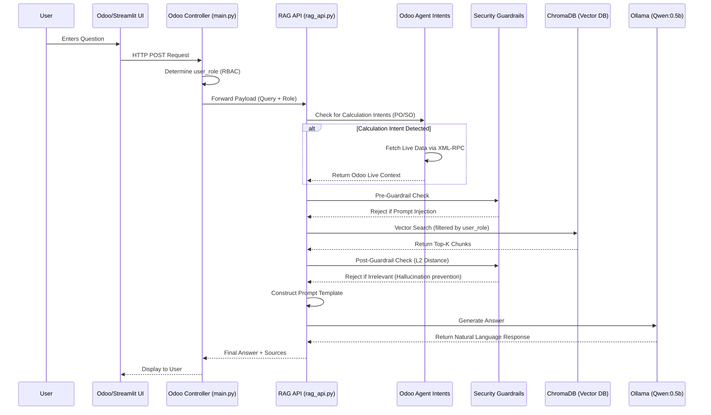
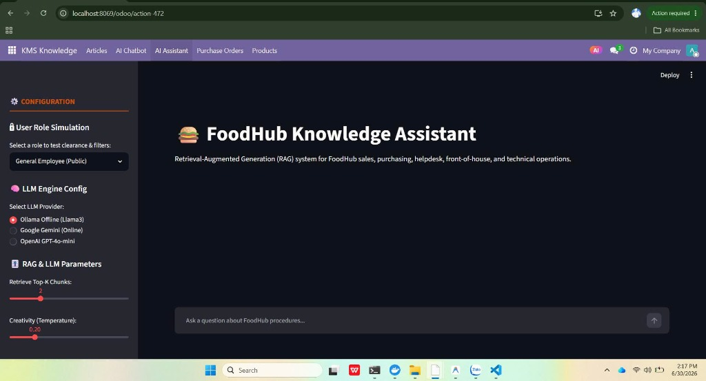
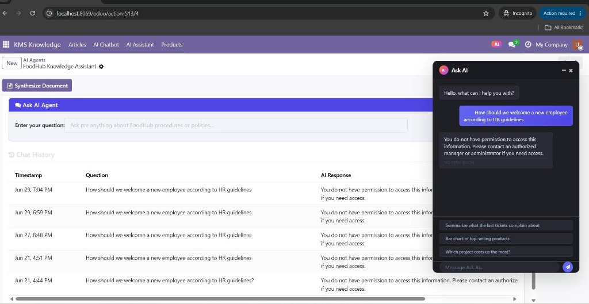
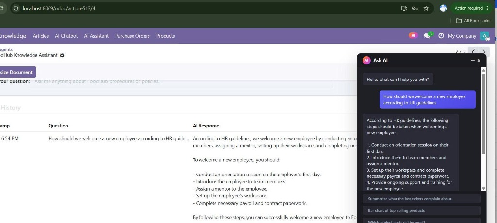
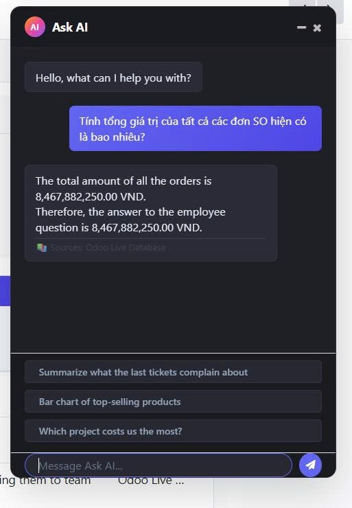
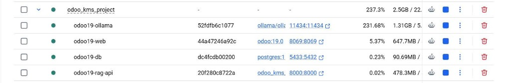

# 🧠 AI ENGINEER DOCUMENTATION

This document details the Data Flow of the AI system when processing a User Prompt, from the initial input to the final generated response.

---

## 1. 🌊 AI Prompt Data Flow Architecture

The system is built on a **Retrieval-Augmented Generation (RAG)** architecture combined with **Odoo Agent Intents**. The lifecycle of a query consists of 10 stages:

### System Flowchart (Mermaid)

### Phase 1: Reception & Authorization
- **Step 1 (User Input)**: The user enters a question into the Chatbot UI (Odoo Widget or Streamlit).
- **Step 2 (Role Assignment)**: The Odoo Controller (`main.py`) receives the query, automatically checks the user's Odoo Group, and assigns a `user_role` flag (`hr_manager`, `it_staff`, or `public`).
- **Step 3 (API Gateway)**: The Odoo Controller pushes the JSON payload (containing the query + role) to the RAG API server (`rag_api.py`).

### Phase 2: Intent Analysis & ERP Integration
- **Step 4 (Intent Detection & Live Data)**: The RAG API passes the query to `detect_intents()`. 
  - If it detects that the user is asking about Purchase Orders (PO) or Sales Orders (SO), the AI Agent triggers a sub-routine: It connects directly to the Odoo Database via XML-RPC, uses `search_read` to fetch live transactional data, and instantly calculates the totals/averages.
  - This data is stored as `odoo_context`.

### Phase 3: Retrieval & Guardrails
- **Step 5 (Pre-Guardrail Check)**: The AI filter checks if the query contains manipulation keywords (Prompt Injection) or sensitive restricted topics. If so, it immediately returns a Fallback error.
- **Step 6 (Vector Search)**: 
  - Converts the query into a Vector using the Embedding model (`all-MiniLM-L6-v2`).
  - Scans the Vector Database (ChromaDB) to find the most semantically relevant document chunks.
  - **Security Lock (RBAC)**: The search query is strictly bound by a Role filter (e.g., `{"access_role": "public"}`), ensuring the Database completely hides confidential HR/IT documents from regular employees.
- **Step 7 (Post-Guardrail Check)**: Evaluates the L2 Distance score of the retrieved documents. If the score is too high (i.e., the topic doesn't exist in the system), the AI execution is halted to prevent "Hallucination".

### Phase 4: Text Generation
- **Step 8 (Prompt Construction)**: The system assembles a massive Prompt using the formula: `Prompt = [System Prompt] + [ChromaDB Context] + [Odoo Live Data Context] + [User Query]`.
- **Step 9 (LLM Inference)**: This Prompt is injected into the ultra-fast offline model **Qwen:0.5b** (via Ollama). The model reads the context and synthesizes a natural language answer.

### Phase 5: Delivery
- **Step 10 (Delivery)**: Returns the conversation payload to the Frontend, including both the generated Answer and the Sources (original document names).

---

## 2. 📸 Project Screenshots & Demo Results

Below are the actual evidence screenshots showing the system operating flawlessly in practice:

### 2.1. Standalone Streamlit Interface
A full-screen chat application running outside Odoo, allowing configuration of RAG parameters, LLM selection, and User Role Simulation.

### 2.2. Odoo Systray Chatbot (Access Control Testing)
A compact chat widget (Ask AI) located at the bottom corner of the Odoo screen.
- **Guardrail - Access Denied**: When an unauthorized account attempts to access confidential information, the AI enforces a strict fallback rejection.
  
- **Authorized Access**: When querying with the correct permissions, the AI successfully extracts internal documents and synthesizes specific steps.
  

### 2.3. ERP Live Data Calculation Intents
The Chatbot doesn't just read static documents; it deeply integrates with the Accounting/Sales modules to automatically calculate total quantities and revenue of Sales Orders (SO) directly from the live Odoo Database.

### 2.4. Docker Container Architecture
The system is professionally packaged and runs on independent containers: Odoo Web, PostgreSQL DB, Ollama Server, and the RAG API Engine.

